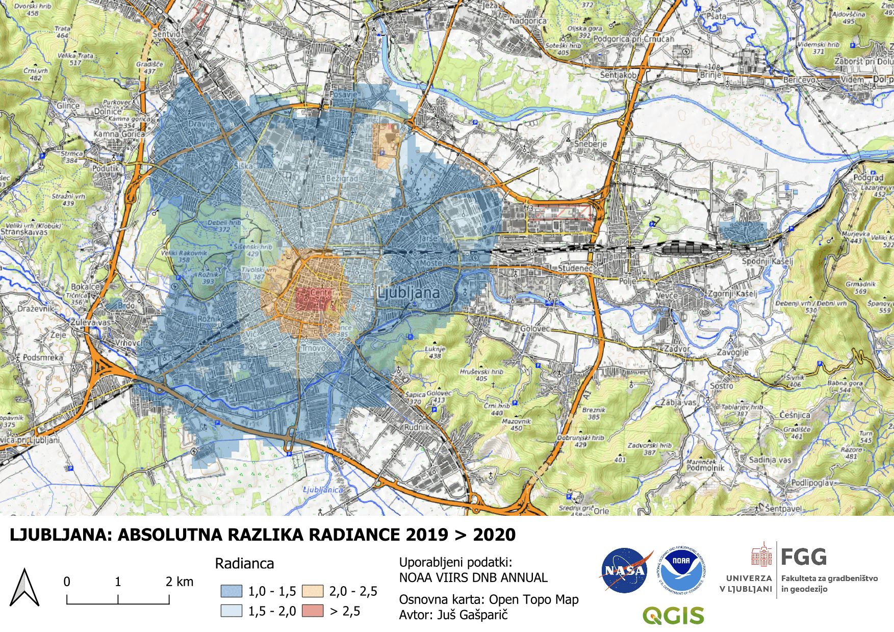

# 🌍 Svetlobna onesnaženost v Ljubljani med pandemijo covid-19

Ta repozitorij vsebuje vizualizacijo **absolutne razlike radiance** v Ljubljani med letoma **2019 in 2020**, ki prikazuje vpliv pandemije na svetlobno onesnaženost. 

## 📌 Animacija svetlobne onesnaženosti

---

### <h2 align="center"><b>Ljubljana: Pandemija</b></h2>

    

---

## 🔗 Povezave
🌍 [NASA Earthdata - Nighttime Lights](https://www.earthdata.nasa.gov/topics/human-dimensions/nighttime-lights)  
🌍 [Lockdown induced night-time light dynamics during the COVID-19 epidemic in global megacities](https://www.sciencedirect.com/science/article/pii/S0303243421001288) 
🌍 [Temno Nebo Slovenija](http://www.temnonebo.si/)  

